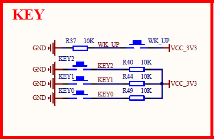
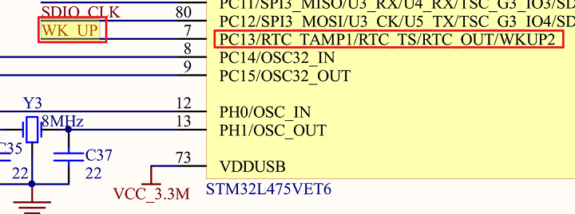
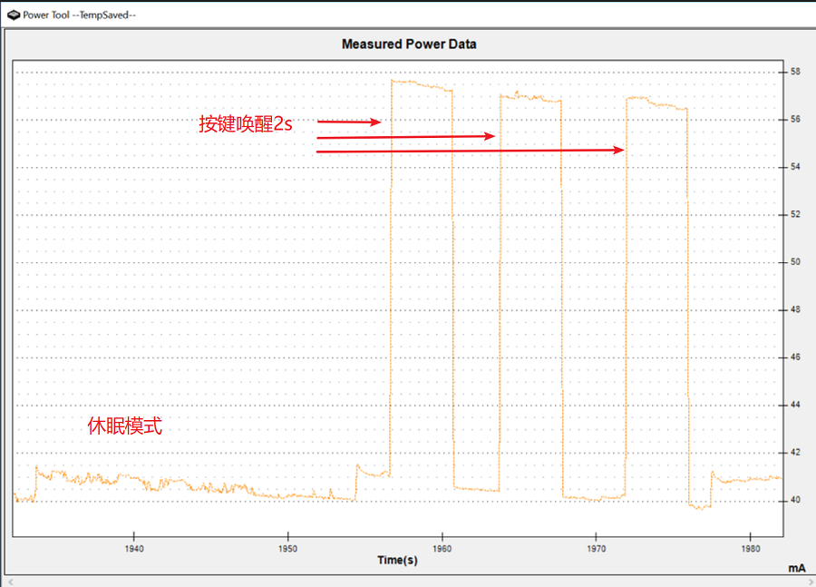

# 低功耗例程

## 简介

随着物联网(IoT)的兴起，产品对功耗的需求越来越强烈。作为数据采集的传感器节点通常需要在电池供电时长期工作，而作为联网的 SOC 也需要有快速的响应功能和较低的功耗。

在产品开发的起始阶段，首先考虑是尽快完成产品的功能开发。在产品功能逐步完善之后，就需要加入电源管理功能。为了适应 IoT 的这种需求，RT-Thread 提供了电源管理框架。电源管理框架的理念是尽量透明，使得产品加入低功耗功能更加轻松。

PM 组件有以下特点：

- PM 组件是基于模式来管理功耗
- PM 组件可以根据模式自动更新设备的频率配置，确保在不同的运行模式都可以正常工作
- PM 组件可以根据模式自动管理设备的挂起和恢复，确保在不同的休眠模式下可以正确的挂起和恢复
- PM 组件支持可选的休眠时间补偿，让依赖 OS Tick 的应用可以透明使用
- PM 组件向上层提供设备接口，如果使用了设备文件系统组件，那么也可以用文件系统接口来访问

本例程演示 RT-Thread 的电源管理组件(Power Management，以下简称 PM 组件)的使用。基于 PM 组件，用户可以很轻松地完成低功耗的开发。

## 硬件说明





如上图所示，例程里将使用 WK_UP 按键唤醒处于休眠状态的 MCU。WK_UP 按键被连接到单片机的7引脚(PC13)，该引脚同时也是作为单片机在休眠模式下的 WAKEUP_PIN2 引脚。

## 软件说明

PM 例程的源代码位于 `/examples/12_component_pm/applications/main.c`中。

我们使用 WK_UP 按键来唤醒处于休眠模式的 MCU。一般情况下，在 MCU 处于比较深度的休眠模式，只能通过特定的方式唤醒。MCU 被唤醒之后，会触发相应的中断。以下例程是用 WK_UP 按键从 `Timer MODE` 唤醒 MCU 并点亮 LED 之2秒后，再次进入休眠的例程。

例程的入口在 `main()` 函数里：

```C
int main(void)
{
 /* 唤醒回调函数初始化 */
    wakeup_init();

    /* 电源管理初始化 */
    pm_mode_init();

    while (1)
    {
        /* 等待唤醒事件 */
        if (rt_event_recv(wakeup_event,
                          WAKEUP_EVENT_BUTTON,
                          RT_EVENT_FLAG_AND | RT_EVENT_FLAG_CLEAR,
                          RT_WAITING_FOREVER, RT_NULL) == RT_EOK)
        {
            led_app();
        }
    }
}
```

`main()` 函数里首先完成初始化工作：包括唤醒事件的初始化、PM 模式的配置；然后在循环里一直等待中断里发来的唤醒事件，如果接收到一次唤醒事件，就执行一次 `led_app()`。

`wakeup_init()` 包括了唤醒事件的初始化和唤醒按键中断回调函数的初始化：

```c
static void wakeup_init(void)
{
    wakeup_event = rt_event_create("wakup", RT_IPC_FLAG_FIFO);
    RT_ASSERT(wakeup_event != RT_NULL);

    bsp_register_wakeup(wakeup_callback);
}
```

`PM_SLEEP_MODE_DEEP` 是 STM32L475 的 STOP2 模式，并在进入之前打开了 LPTIM1。我们希望停留在 `PM_SLEEP_MODE_DEEP` 模式，我们首先需要调用一次 rt_pm_request() 来请求该模式。

```C
static void pm_mode_init(void)
{
    rt_pm_request(PM_SLEEP_MODE_DEEP);
}
```

`led_app()` 里我们希望点亮 LED 灯，并延时足够的时间以便我们观察到现象。在延时的时候，CPU 可能处于空闲状态，如果没有任何运行模式被请求，将会进入休眠。我们请求了`PM_SLEEP_MODE_NONE` 模式，即该模式下 CPU 不进行休眠，并在完成 LED 闪烁完成之后释放它，这样就可以让确保请求和释放中间的代码运行在 `PM_SLEEP_MODE_NONE` 模式。`_pin_as_analog()` 函数是把 LED 对应的引脚设置为模拟 IO，这样可以使得 IO 的功耗达到最低：

```C
static void led_app(void)
{
    rt_pm_request(PM_SLEEP_MODE_NONE);

    rt_pin_mode(PIN_LED_R, PIN_MODE_OUTPUT);
    rt_pin_write(PIN_LED_R, 0);
    rt_thread_mdelay(2000);
    rt_pin_write(PIN_LED_R, 1);
    _pin_as_analog();

    rt_pm_release(PM_SLEEP_MODE_NONE);
}
```

## 运行

### 编译&下载

- **MDK**：双击 `project.uvprojx` 打开 MDK5 工程，执行编译。
- **IAR**：双击 `project.eww` 打开 IAR 工程，执行编译。

编译完成后，将开发板的 ST-Link USB 口与 PC 机连接，然后将固件下载至开发板。

### 运行效果

按下复位按键重启开发板，很快就进入休眠模式。我们三次按下 WK_UP 按键。每次按下按键，MCU 都会被唤醒点亮 LED 2秒之后，再次进入休眠。下图是唤醒过程中的 Power Monitor 运行截图：



## 注意事项

在芯片处于休眠模式下，一般是无法连接到仿真接口，所以就无法使用 ST-Link 下载程序。我们可以在芯片处于非休眠模式时下载，具体方式如下：

- 按住复位键，点击 MDK 或者 IAR 的下载后，1 秒左右再松开复位键
- 按下 WK_UP 键，马上点击 MDK 或者 IAR 的完成下载

## 引用参考

- 《电源管理应用笔记》: docs/AN0025-RT-Thread-电源管理组件应用笔记.pdf
- 《电源管理用户手册》: docs/UM1009-RT-Thread-电源管理组件用户手册.pdf
- 《通用 GPIO 设备应用笔记》: docs/AN0002-RT-Thread-通用 GPIO 设备应用笔记.pdf
